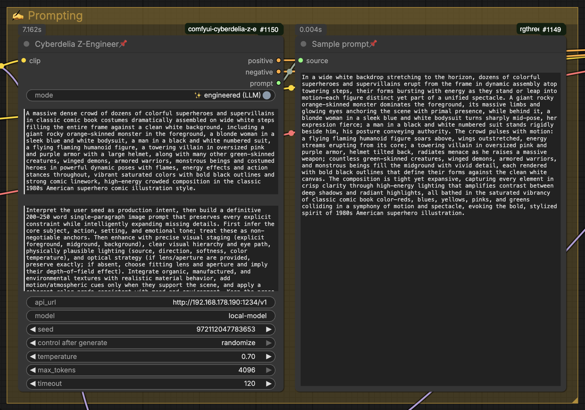

# comfyui-cyberdelia-z-engineer

Model-independent, LLM-powered prompt engineering for ComfyUI. The node calls an OpenAI-compatible API, cleans and preserves the generated prompt, and CLIP-encodes it directly into sampler-ready conditioning.

By **Cyberdelia AI Lab** · [github.com/cyberdeliaAI](https://github.com/cyberdeliaAI)

---



## What it does

**Cyberdelia Z-Engineer** sends a seed prompt to LM Studio, Ollama, or another OpenAI-compatible server. It returns:

- positive conditioning encoded from the enhanced prompt;
- empty negative conditioning for save-node compatibility;
- the final enhanced prompt as a string.

Existing workflows can bypass the LLM with the built-in passthrough toggle.

## Features

- **CLIP encoding built in** — no separate CLIP Text Encode node required
- **Automatic LM Studio model discovery** — loaded LLMs are marked in a model selector
- **Safe `auto` model selection** — only chooses when one model is unambiguous
- **System-prompt presets** — one bundled Cyberdelia preset plus user-authored `.txt` presets
- **Visible preset content** — selecting a preset fills the normal, editable `system_prompt` field
- **Keep terms** — preserve LoRA triggers, names, or phrases verbatim
- **Optional constraint preservation** — conservatively retains quoted text, counts, colors, codes, and lens/aperture details
- **Output cleaning** — strips reasoning blocks, ChatML, Markdown fences, prompt labels, negative-prompt sections, and excess whitespace
- **Configurable error handling** — fall back to input, stop the workflow, or return empty conditioning
- **Targeted retries** — retries transient connection, timeout, HTTP 429, and HTTP 5xx failures
- **Metadata-friendly runtime output** — publishes the actually encoded text to compatible metadata extensions

## Requirements

- A recent ComfyUI version with `clip.encode_from_tokens_scheduled`
- A running OpenAI-compatible chat-completions endpoint
- `requests`

LM Studio is recommended because it also exposes loaded-model information through its native model API. Other OpenAI-compatible servers remain supported through the manual `model` field and `/v1/models` fallback.

## Installation

Via ComfyUI Manager, search for **Cyberdelia** and install the node.

Manual installation:

```bash
cd ComfyUI/custom_nodes
git clone https://github.com/cyberdeliaAI/comfyui-cyberdelia-z-engineer.git
pip install -r comfyui-cyberdelia-z-engineer/requirements.txt
```

Restart ComfyUI after installation or updating.

## Basic usage

1. Add **Cyberdelia Z-Engineer** from `Cyberdelia/Prompt`.
2. Connect the `CLIP` output from your model or LoRA loader.
3. Connect `positive` and `negative` to the sampler.
4. Enter a seed prompt in `text`.
5. Choose a system-prompt preset or keep `Custom` and edit `system_prompt` directly.
6. Set the OpenAI-compatible `api_url`.
7. Choose a discovered model, enter a manual model ID, or use `auto`.
8. Queue the workflow.

## Model selection

The frontend model selector is a convenience control that updates the existing `model` field, so the selected model remains stored in the workflow.

`auto` follows conservative rules:

1. If exactly one LLM is loaded, use it.
2. If nothing is loaded and exactly one LLM is available, use it.
3. If multiple choices are possible, report an ambiguity instead of choosing arbitrarily.

Loaded models are shown first and marked `[loaded]`. Embedding models are excluded. Use **↻ Refresh models** after changing models in LM Studio. If discovery is unavailable, type a model ID in the existing `model` field.

The node does not call LM Studio's model-management endpoints and never unloads or evicts models. A normal chat request can still trigger LM Studio's own JIT loading if that option is enabled in LM Studio.

## Presets

The bundled preset is **Cyberdelia Detailed 200–250**. `Custom` remains the default and uses the visible `system_prompt` value unchanged.

The requested 200–250-word range is an instruction to the selected model; the node does not mechanically rewrite or pad the result to enforce that length.

To add a personal preset, create a UTF-8 `.txt` file in:

```text
ComfyUI/user/z_engineer/presets/
```

If ComfyUI was started with a custom user directory, the `z_engineer/presets` folder is created under that directory instead. The filename becomes the dropdown label and the complete file content becomes the system prompt.

Choose **↻ Refresh presets** after adding or editing a file. Selecting a preset copies its full text into `system_prompt`; editing that field switches the selector back to `Custom`. Because the actual text is stored in the workflow, old workflows stay reproducible if a preset file later changes.

Presets intentionally contain no model or sampling settings.

## Preservation and cleaning

`keep_terms` accepts terms separated by commas, semicolons, or line breaks:

```text
m4rty style, OHWX woman, neon_glow
```

The node asks the LLM to retain them and deterministically appends any missing terms with their original casing.

`preserve_constraints` is off by default. When enabled, it applies the same two-stage instruction and post-check to conservative constraints extracted from the seed:

- quoted text;
- counts up to twenty or numeric counts;
- color/object phrases;
- code-like identifiers such as `RX-78`;
- lens/aperture strings such as `24-70mm f/2.8`.

It does not add model-specific instructions, force a target word count, or pad short prompts.

`clean_output` is on by default. It removes technical model artefacts but does not remove camera brands or rewrite the prompt style.

## Error handling and retries

`error_mode` controls what happens after the request ultimately fails:

| Mode | Result |
| --- | --- |
| `fallback_input` | Continue with the original seed prompt (default) |
| `stop` | Raise the original error and stop the workflow |
| `empty` | Return empty positive and negative conditioning |

`retries` defaults to `1`, meaning one initial attempt plus one retry. Retries are limited to connection errors, timeouts, HTTP 429, and HTTP 5xx responses, with a short backoff. Permanent request errors are not retried.

Fallback and passthrough text are never cleaned or modified.

## Parameters

| Parameter | Description |
| --- | --- |
| `clip` | CLIP model used to encode the final prompt |
| `mode` | Enhanced LLM mode or raw passthrough |
| `text` | Input concept or seed prompt |
| `system_prompt` | Visible instructions sent to the LLM |
| `api_url` | OpenAI-compatible base URL, normally `http://localhost:1234/v1` |
| `model` | Manual model ID or `auto` |
| `seed` | Sampling seed sent to the API |
| `temperature` | Sampling temperature sent to the API |
| `max_tokens` | Maximum output tokens sent to the API |
| `timeout` | Request timeout in seconds |
| `keep_terms` | Exact terms that must survive generation |
| `preserve_constraints` | Enable conservative seed-constraint preservation |
| `clean_output` | Remove technical LLM output artefacts |
| `error_mode` | `fallback_input`, `stop`, or `empty` |
| `retries` | Number of transient-error retries, from 0 to 3 |

`top_p`, `top_k`, and `min_p` are deliberately not sent; configure them in LM Studio or your chosen server.

## Outputs

| Output | Type | Description |
| --- | --- | --- |
| `positive` | `CONDITIONING` | CLIP-encoded final prompt |
| `negative` | `CONDITIONING` | CLIP-encoded empty string |
| `prompt` | `STRING` | Exact text used for positive conditioning |

For guaranteed metadata capture, connect `prompt` directly to the prompt-text input of your image saver. Compatible metadata extensions may also receive the resolved runtime text through the node's metadata cache integration.

## Testing

Run the standalone unit tests from the custom-node directory:

```bash
python -m unittest discover -s tests -v
```

## License

MIT — see [LICENSE](LICENSE).

## Credits

Built by **Cyberdelia AI Lab** · [github.com/cyberdeliaAI](https://github.com/cyberdeliaAI)

Based on [**ComfyUI-Z-Engineer**](https://github.com/BennyDaBall930/ComfyUI-Z-Engineer) by [BennyDaBall930](https://github.com/BennyDaBall930) (MIT licensed).
